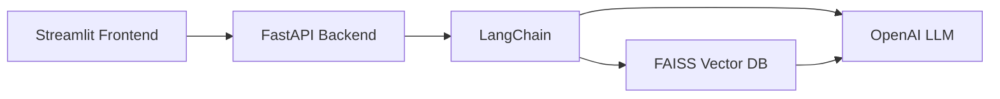

> **Chapter 3: Resilient distributed datasets in PySpark**  
> Not part of the final exam!

### RAG System Architecture

1. محاضرة BDA 09: PySpark Setup
       https://youtu.be/OiSjuyA14Qo?si=mSanURpBqANNoke-
2. The 1st PySpark Example: How to create a PySpark dataframe from csv file?
       https://youtu.be/bzt48VssWHU?si=KnQvqcm7TQ-Z7Fph
3. Steps to install & run the RAG system locally
       https://youtu.be/0WupYW3lz2w?si=L0wPIHRmEuPuiizI

---
· مشروع RAG PDF Teaching Demo (كمثال تطبيقي)
      https://github.com/fatimarajab12/RAGPDFTeachingDemo
